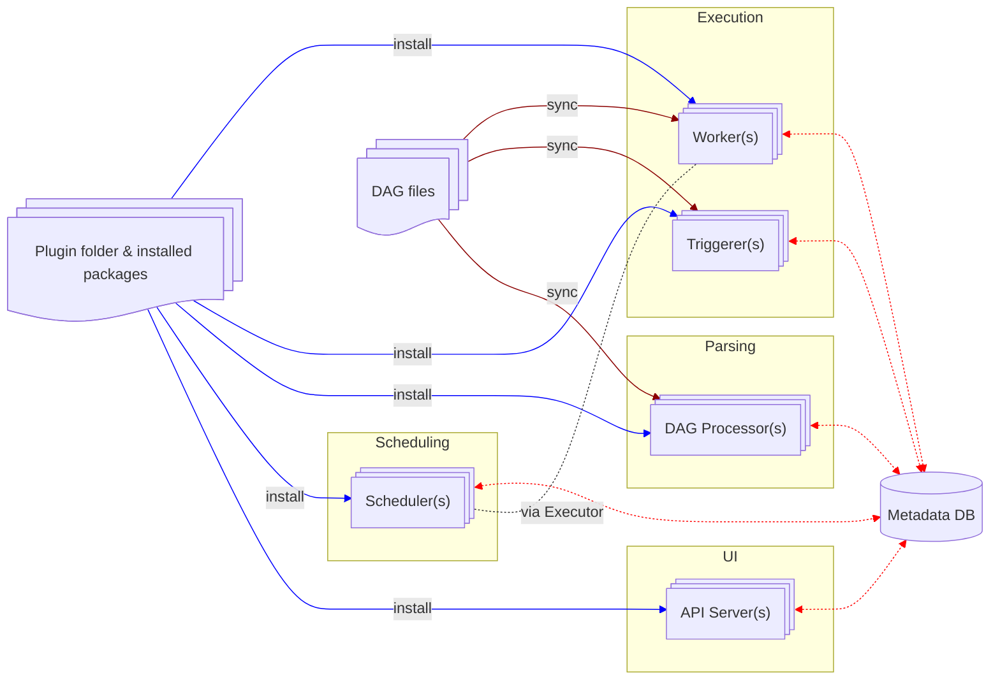

# Airflow Components

This section is based on [Core Concepts > Architecture Overview](https://airflow.apache.org/docs/apache-airflow/3.0.6/core-concepts/overview.html) with each component summarized for someone to cross-reference if necessary.

The diagram below is based on the [separate DAG processing architecture](https://airflow.apache.org/docs/apache-airflow/3.0.6/core-concepts/overview.html#separate-dag-processing-architecture) to illustrate what components to expect and how they interact with each other.

## Scheduler

## Executor

## Worker

Within the worker, there are two additional processes, [Supervisor](#supervisor) and [Task Runner](#task-runner). See the related [task lifecycle](concepts.md#task-lifecycle) for more information on the order of execution.

### Supervisor

As summarized in [Supervisor & Task Runner](https://airflow.apache.org/docs/task-sdk/1.0.6/concepts.html#supervisor-task-runner):
> Within an Airflow [worker](#worker), a Supervisor process manages the execution of [task instances](concepts.md#task-instance):
> * Spawns isolated subprocesses ([Task Runners](#task-runner)) for each [task](concepts.md#task), following a parent–child model.
> * Establishes dedicated STDIN, STDOUT, and log pipes to communicate with each subprocess.
> * Proxies Execution API calls: forwards subprocess requests (e.g., variables, connections, XCom operations, state transitions) to the API server and relays responses.
> * Monitors subprocess liveness via heartbeats and marks tasks as failed if heartbeats are missed.
> * Generates and refreshes JWT tokens on behalf of subprocesses through heartbeat responses to ensure authenticated API calls.

### Task Runner

As summarized in [Supervisor & Task Runner](https://airflow.apache.org/docs/task-sdk/1.0.6/concepts.html#supervisor-task-runner):
> A Task Runner subprocess provides a sandboxed environment where user task code runs:
> * Receives startup messages (run parameters) via STDIN from the [Supervisor](#supervisor).
> * Executes the Python function or operator code in isolation.
> * Emits logs through STDOUT and communicates runtime events (heartbeats, XCom messages) via the Supervisor.
> * Performs final state transitions by sending authenticated API calls through the Supervisor.
