# Apache Airflow Core Concepts

This section will aggregate, distill, and reference [core concepts](https://airflow.apache.org/docs/apache-airflow/3.0.6/core-concepts/index.html) within Apache Airflow.

## DAG

From [Core Concepts > Dags](https://airflow.apache.org/docs/apache-airflow/3.0.6/core-concepts/dags.html),
> A DAG is a model that encapsulates everything needed to execute a workflow. Some DAG attributes include the following:
> * **Schedule:** When the workflow should run.
> * **Tasks:** [tasks](#task) are discrete units of work that are run on workers.
> * **Task Dependencies:** The order and conditions under which tasks execute.
> * **Callbacks:** Actions to take when the entire workflow completes.
> * **Additional Parameters:** And many other operational details.

### DAG Run

From [Core Concepts > DAG Runs](https://airflow.apache.org/docs/apache-airflow/3.0.6/core-concepts/dag-run.html),
> A DAG Run is an object representing an instantiation of the DAG in time. Any time the DAG is executed, a DAG Run is created and all tasks inside it are executed. The status of the DAG Run depends on the tasks states. Each DAG Run is run separately from one another, meaning that you can have many runs of a DAG at the same time.

### TaskGroup

From [Core Concepts > Dags > TaskGroups](https://airflow.apache.org/docs/apache-airflow/3.0.6/core-concepts/dags.html#taskgroups)
> A TaskGroup can be used to organize tasks into hierarchical groups in Graph view. It is useful for creating repeating patterns and cutting down visual clutter.
> 
> Tasks in TaskGroups live on the same original DAG, and honor all the DAG settings and pool configurations.
> 
> Dependency relationships can be applied across all tasks in a TaskGroup with the >> and << operators.

## Task

From [Core Concepts > Tasks](https://airflow.apache.org/docs/apache-airflow/3.0.6/core-concepts/tasks.html),
> A Task is the basic unit of execution in Airflow. Tasks are arranged into [Dags](#dag), and then have upstream and downstream dependencies set between them in order to express the order they should run in.
> 
> There are three basic kinds of Task:
> * [Operators](#operators), predefined task templates that you can string together quickly to build most parts of your dags.
> * [Sensors](#sensors), a special subclass of Operators which are entirely about waiting for an external event to happen.
> * A [TaskFlow](#taskflow)-decorated [@task](sdk.md#airflowsdktask), which is a custom Python function packaged up as a Task.
> 
> Internally, these are all actually subclasses of Airflow’s [BaseOperator](sdk.md#airflowsdkbaseoperator), and the concepts of Task and Operator are somewhat interchangeable, but it’s useful to think of them as separate concepts - essentially, Operators and Sensors are templates, and when you call one in a DAG file, you’re making a Task.

### Task Lifecycle

The [task lifecycle](https://airflow.apache.org/docs/task-sdk/1.0.6/concepts.html#task-lifecycle) can be broken down as follows:
> * **Scheduled:** The Airflow [scheduler](components.md#scheduler) enqueues the [task instance](#task-instance). The [Executor](components.md#executor) assigns a workload token used for subsequent API authentication and validation with the Airflow API Server.
> * **Queued:** Workers poll the queue to retrieve and reserve queued task instances.
> * **Subprocess Launch:** The worker’s [Supervisor](components.md#supervisor) process spawns a dedicated subprocess ([Task Runner](components.md#task-runner)) for the task instance, isolating its execution.
> * **Run API Call:** The [Supervisor](components.md#supervisor) sends a `POST /run` call to the Execution API to mark the task as running; the API server responds with a `TIRunContext` containing essential runtime information including:
>  * `dag_run`: Complete [DAG run](#dag-run) information (logical date, data intervals, configuration, etc.)
>  * `max_tries`: Maximum number of retry attempts allowed for this task instance
>  * `should_retry`: Boolean flag indicating whether the task should enter retry state or fail immediately on error
>  * `task_reschedule_count`: Number of times this task has been rescheduled
>  * `variables`: List of Airflow variables accessible to the task instance
>  * `connections`: List of Airflow connections accessible to the task instance
>  * `upstream_map_indexes`: Mapping of upstream task IDs to their map indexes for dynamic task mapping scenarios
>  * `next_method`: Method name to call when resuming from a deferred state (set when task resumes from a trigger)
>  * `next_kwargs`: Arguments to pass to the `next_method` (can be encrypted for sensitive data)
>  * `xcom_keys_to_clear`: List of XCom keys that need to be cleared and purged by the worker
> * **Runtime Dependency Fetching:** During execution, if the task code requests Airflow resources (variables, connections, etc.), it writes a request to STDOUT. The [Supervisor](components.md#supervisor) receives it and issues a corresponding API call, and writes the API response into the subprocess’s STDIN.
> * **Heartbeats & Token Renewal:** The [Task Runner](components.md#task-runner) periodically emits `POST /heartbeat` calls through the [Supervisor](components.md#supervisor). Each call authenticates via JWT; if the token has expired, the API server returns a refreshed token in the `Refreshed-API-Token` header.
> * **XCom Operations:** Upon successful task completion (or when explicitly invoked during execution), the [Supervisor](components.md#supervisor) issues API calls to set or clear XCom entries for inter-task data passing.
> * **State Patch:** When the task reaches a terminal (success/failed), deferred, or rescheduled state, the [Supervisor](components.md#supervisor) invokes `PATCH /state` with the final task status and metadata.

### Operators

From [Core Concepts > Operators](https://airflow.apache.org/docs/apache-airflow/3.0.6/core-concepts/operators.html),
> An Operator is conceptually a template for a predefined [Task](#task), that you can just define declaratively inside your DAG:

Refer to [airflow.sdk.BaseOperator](sdk.md#airflowsdkbaseoperator) for the related subclass.

### Sensors

From [Core Concepts > Sensors](https://airflow.apache.org/docs/apache-airflow/3.0.6/core-concepts/sensors.html),
> Sensors are a special type of [Operator](#operators) that are designed to do exactly one thing - wait for something to occur. It can be time-based, or waiting for a file, or an external event, but all they do is wait until something happens, and then succeed so their downstream tasks can run.

Refer to [airflow.sdk.BaseSensorOperator](sdk.md#airflowsdkbasesensoroperator) for the related subclass.

### TaskFlow

From [Core Concepts > TaskFlow](https://airflow.apache.org/docs/apache-airflow/3.0.6/core-concepts/taskflow.html),
> If you write most of your dags using plain Python code rather than [Operators](#operators), then the TaskFlow API will make it much easier to author clean dags without extra boilerplate, all using the [@task](sdk.md#airflowsdktask) decorator.
> 
> TaskFlow takes care of moving inputs and outputs between your Tasks using XComs for you, as well as automatically calculating dependencies - when you call a TaskFlow function in your DAG file, rather than executing it, you will get an object representing the XCom for the result (an XComArg), that you can then use as inputs to downstream tasks or operators.

### Task Instance

From [Core Concepts > Tasks > Task Instances](https://airflow.apache.org/docs/apache-airflow/3.0.6/core-concepts/tasks.html#task-instances)
> Much in the same way that a DAG is instantiated into a DAG Run each time it runs, the tasks under a DAG are instantiated into Task Instances.
> 
> An instance of a Task is a specific run of that task for a given DAG (and thus for a given data interval). They are also the representation of a Task that has state, representing what stage of the lifecycle it is in.
> 
> The possible states for a Task Instance are:
> * `none`: The Task has not yet been queued for execution (its dependencies are not yet met)
> * `scheduled`: The scheduler has determined the Task’s dependencies are met and it should run
> * `queued`: The task has been assigned to an Executor and is awaiting a worker
> * `running`: The task is running on a worker (or on a local/synchronous executor)
> * `success`: The task finished running without errors
> * `restarting`: The task was externally requested to restart when it was running
> * `failed`: The task had an error during execution and failed to run
> * `skipped`: The task was skipped due to branching, LatestOnly, or similar.
> * `upstream_failed`: An upstream task failed and the Trigger Rule says we needed it
> * `up_for_retry`: The task failed, but has retry attempts left and will be rescheduled.
> * `up_for_reschedule`: The task is a [Sensor](#sensors) that is in `reschedule` mode
> * `deferred`: The task has been deferred to a trigger
> * `removed`: The task has vanished from the DAG since the run started

The task instance state transition diagram from the documentation is simplified slightly below:

```mermaid
stateDiagram-v2
    direction LR

    state none
    state scheduled
    state queued
    state running
    state success
    state restarting
    state failed
    state skipped
    state upstream_failed
    state up_for_retry
    state up_for_reschedule
    state deferred
    state removed

    state is_required_upstream_tasks_failed <<choice>>
    state is_task_should_be_skipped <<choice>>
    state is_task_instance_still_available <<choice>>
    state is_task_instance_got_restored <<choice>>
    state is_triggerer_task <<choice>>
    state is_triggerer_task_2 <<choice>>
    state is_task_completes <<choice>>
    state is_task_is_deferrable_and_defer_signal_is_raised <<choice>>
    state is_skip_signal_is_raised <<choice>>
    state is_task_is_a_sensor_in_reschedule_mode_and_result_is_undetermined <<choice>>
    state is_task_marked_as_failed <<choice>>
    state is_task_marked_as_cleared <<choice>>
    state is_task_got_error <<choice>>
    state is_task_completes_2 <<choice>>
    state is_eligible_for_retry <<choice>>

    [*] --> none
    none --> is_required_upstream_tasks_failed: Required upstream task(s) failed?

    is_required_upstream_tasks_failed --> is_task_should_be_skipped: YES, Task should be skipped?
    is_required_upstream_tasks_failed --> upstream_failed: NO

    is_task_should_be_skipped --> skipped: YES
    is_task_should_be_skipped --> is_task_instance_still_available: NO, Task instance is still available?

    is_task_instance_still_available --> scheduled: YES
    is_task_instance_still_available --> removed: NO

    removed --> is_task_instance_got_restored: Task instance got restored?
    is_task_instance_got_restored --> none: YES
    is_task_instance_got_restored --> removed: NO

    scheduled --> queued
    queued --> is_triggerer_task: A triggerer task? (can execute just only with triggerer)

    is_triggerer_task --> deferred: YES
    is_triggerer_task --> running: NO

    deferred --> is_triggerer_task_2: A triggerer task?
    is_triggerer_task_2 --> is_task_completes: YES, Task completes?
    is_triggerer_task_2 --> is_required_upstream_tasks_failed: NO

    is_task_completes --> is_task_is_deferrable_and_defer_signal_is_raised: YES, Task is deferrable and defer signal is raised?
    is_task_completes --> deferred: NO
    
    is_task_is_deferrable_and_defer_signal_is_raised --> deferred: YES
    is_task_is_deferrable_and_defer_signal_is_raised --> is_skip_signal_is_raised: NO, Skip signal is raised?

    is_skip_signal_is_raised --> skipped: YES
    is_skip_signal_is_raised --> is_task_is_a_sensor_in_reschedule_mode_and_result_is_undetermined: NO, Task is a sensor in reschedule mode, and result is undetermined?

    is_task_is_a_sensor_in_reschedule_mode_and_result_is_undetermined --> up_for_reschedule: YES
    up_for_reschedule --> is_required_upstream_tasks_failed
    is_task_is_a_sensor_in_reschedule_mode_and_result_is_undetermined --> is_task_marked_as_failed: NO, Task marked as failed?

    is_task_marked_as_failed --> failed: YES
    is_task_marked_as_failed --> is_task_marked_as_cleared: NO, Task marked as cleared?

    is_task_marked_as_cleared --> restarting: YES
    restarting --> up_for_retry
    is_task_marked_as_cleared --> is_task_got_error: NO, Task got error?

    is_task_got_error --> is_eligible_for_retry: YES, Eligible for retry?
    is_task_got_error --> is_task_completes_2: NO, Task completes?

    is_eligible_for_retry --> up_for_retry: YES
    up_for_retry --> is_required_upstream_tasks_failed
    is_eligible_for_retry --> failed: NO

    is_task_completes_2 --> success: YES
    is_task_completes_2 --> running: NO
    running --> is_task_is_deferrable_and_defer_signal_is_raised

    upstream_failed --> [*]
    removed --> [*]
    skipped --> [*]
    failed --> [*]
    success --> [*]

    classDef stateForDeferrableTasks fill:pink
    classDef stateForSensors fill:yellow
    classDef terminalState fill:lightgreen
    class deferred stateForDeferrableTasks
    class up_for_reschedule stateForSensors
    class upstream_failed, removed, skipped, failed, success terminalState
```

## Executor

From [Core Concepts > Executor](https://airflow.apache.org/docs/apache-airflow/3.0.6/core-concepts/executor/index.html),
> Executors are the mechanism by which [task instances](#task-instance) get run. They have a common API and are "pluggable", meaning you can swap executors based on your installation needs.

## Asset

From [Authoring and Scheduling > Asset Definitions](https://airflow.apache.org/docs/apache-airflow/3.0.6/authoring-and-scheduling/assets.html),
> An Airflow asset is a logical grouping of data. Upstream producer tasks can update assets, and asset updates contribute to scheduling downstream consumer dags.
> 
> [Uniform Resource Identifier (URI)](https://en.wikipedia.org/wiki/Uniform_Resource_Identifier) define assets:
> [...]
> 
> Airflow makes no assumptions about the content or location of the data represented by the URI, and treats the URI like a string. This means that Airflow treats any regular expressions, like `input_\d+.csv`, or file glob patterns, such as `input_2022*.csv`, as an attempt to create multiple assets from one declaration, and they will not work.
> 
> You must create assets with a valid URI. Airflow core and providers define various URI schemes that you can use, such as file (core), postgres (by the Postgres provider), and s3 (by the Amazon provider). Third-party providers and plugins might also provide their own schemes. These pre-defined schemes have individual semantics that are expected to be followed. You can use the optional name argument to provide a more human-readable identifier to the asset.

## Dynamic Task Mapping

From [Authoring and Scheduling > Dynamic Task Mapping](https://airflow.apache.org/docs/apache-airflow/3.0.6/authoring-and-scheduling/dynamic-task-mapping.html),
> Dynamic Task Mapping allows a way for a workflow to create a number of tasks at runtime based upon current data, rather than the Dag author having to know in advance how many tasks would be needed.
> 
> This is similar to defining your tasks in a for loop, but instead of having the DAG file fetch the data and do that itself, the scheduler can do this based on the output of a previous task. Right before a mapped task is executed the scheduler will create `n` copies of the task, one for each input.
> 
> It is also possible to have a task operate on the collected output of a mapped task, commonly known as map and reduce.
